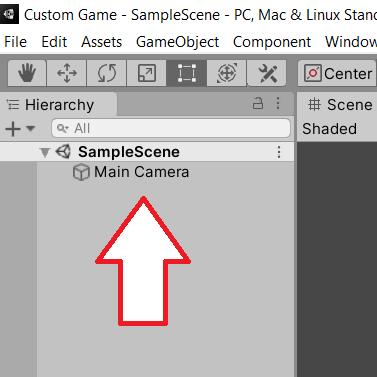
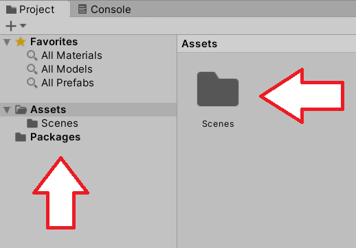
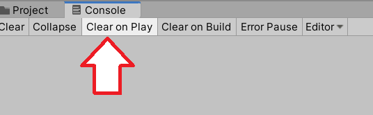
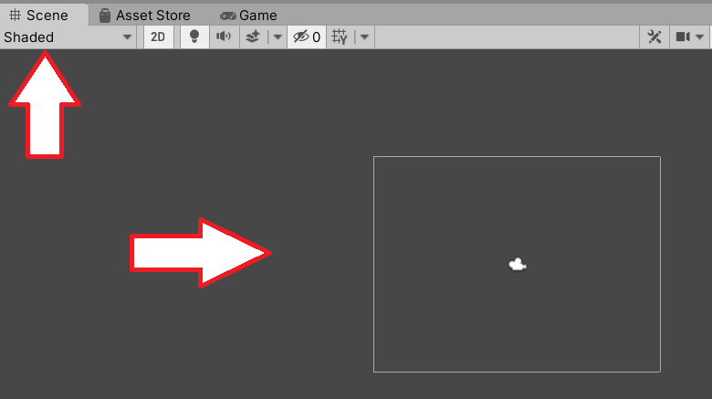
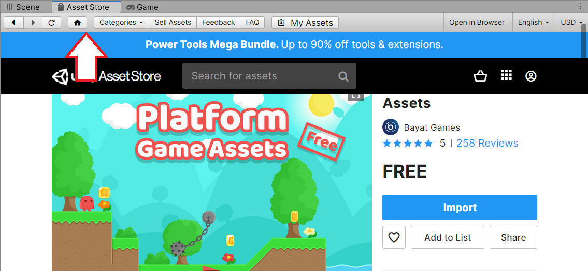
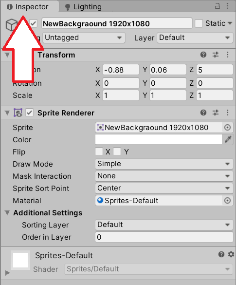

# Interface

In this section, we will look at the main interface components of Unity.  The ones we care about the most are

1. Hierarchy - this shows all the objects that have been added to the scene.

2. Project - this section contains all the assets that have been imported

3. Console - this helps us debug our games

4. Scene - this is the visual representation of the items added to our game

5. Asset Store - this contains pre-made assets from Unity or other creators.

6. Inspector - this section shows us details about objects added to the scene.

