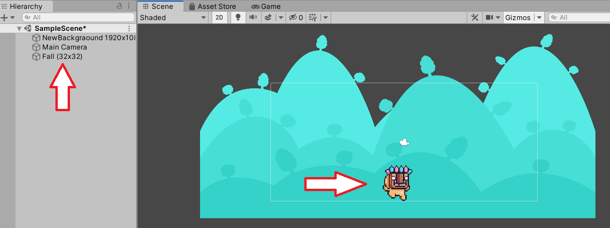
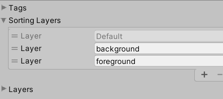

# Adding to Scene

This is the best part!  Choose assets from the Project window and drag the into the Scene window.  Then, move the asset around to look the way you want them to.

## Sorting Layers

Remember, as you add assets, you may want some assets to be above another.  That is where Sorting Layers come in.  You can assign a layer to an object after you create a custom layer.

You can also set the order of the layers.

