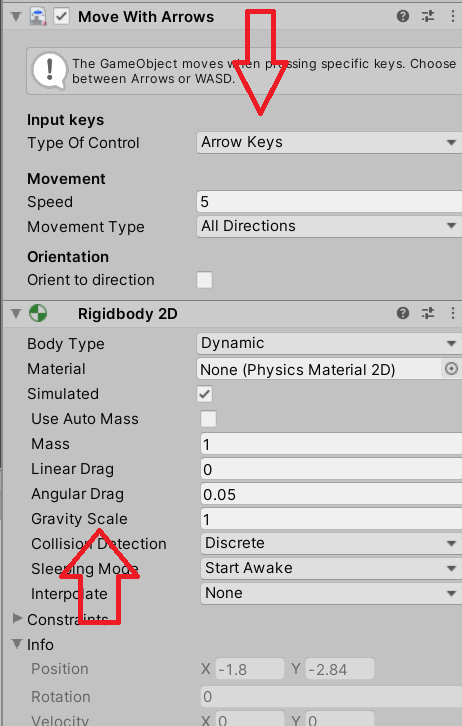
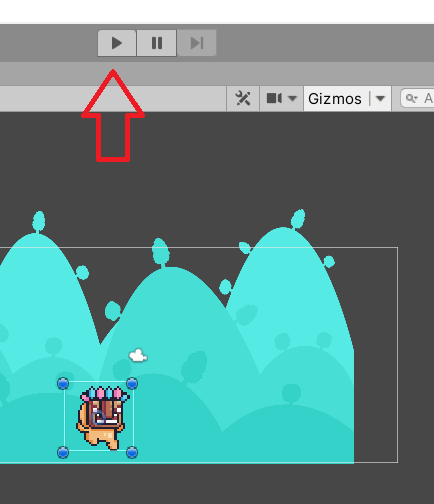

# Adding Scripts to Project

If we use existing scripts, we can design a game with custom assets.  This gives us the ability to create prototypes and create proof of concepts before diving into the customization of game programming.  It also allows game designers to focus on what is most important to them - game play.

In the Project window, you will find the movement scripts.

After this script is found, then you want to drag the script into the Inspector window to add it to the object.

Notice that after the script is added as a component, it adds not only the script, but also the RigidBody2D which is what allows the object to interact in the scene.

Don't forget to adjust the gravity so the object doesn't fall straight down.

Finally, press play to see how the script and the object work together.

